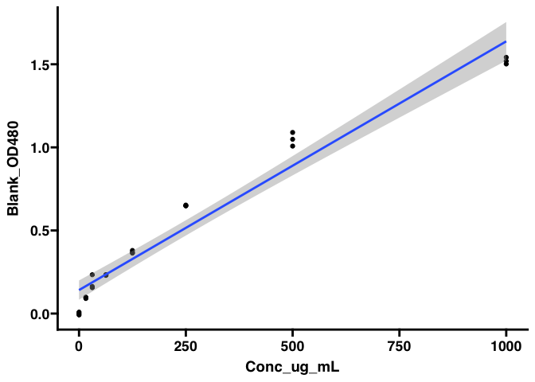
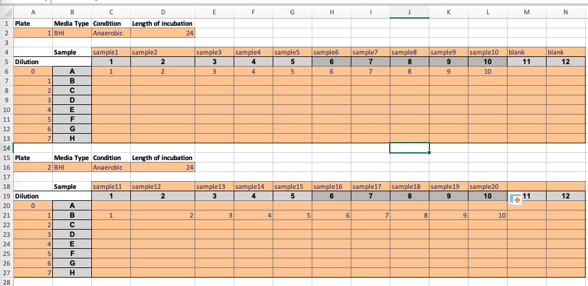
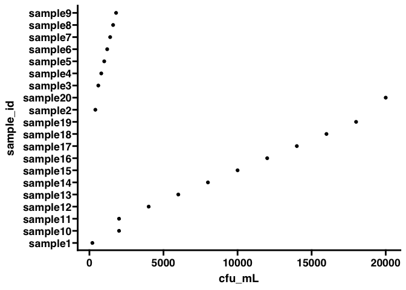

<!-- README.md is generated from README.Rmd. Please edit that file -->

# GLabR <a href='https://github.com/baynec2/GLabR'></a>

<!-- badges: start -->

[](https://github.com/baynec2/GLabR/actions/workflows/R-CMD-check.yaml)
<!-- badges: end -->

The goal of GLabR is to provide a centralized locations to hold
functions that are routinely useful in the Gonzalez Lab at UCSD

## Installation

You can install the development version of GLabR like so:

``` r
devtools::install_github("baynec2/GlabR")
```

## Examples

### Data normalization (batch correction)

The first use case of GlabR is to normalize data that we export from
proteome discoverer. Here, a text file containing PSMs is exported and
subsequently needs to be processed. To accomplish this, there are a few
different steps that need to be followed . These are described below.

1.  We need to combine PSMs from each of the different fractions (there
    are multiple fractions corresponding to a single sample). This is
    accomplished using the combine_psm_fractions() function.
    Essentially, this function filters out PSMs based on certain
    criteria and then sums the intensities for each protein that they
    map to.

2.  Then we need to normalize our data to account for batch corrections.
    This is accomplished using the normalize_to_bridge() function.

- In some cases, there may not be a bridge channel included, and in
  these cases we will need to use the normalize_1plex() function instead

3.  After this, we still might want to normalize the data further. To
    get data that is more normally distributed, we can use Leigh-ana’s
    method of box cox normalization through the la_box_cox_norm()
    function.

Here we can see an example of the overall workflow using a single plex
example set

``` r
library(GLabR)

data = read_delim("tests/testdata/combine_psm_fractions/PCB002_PSMs_Proteodiscover_output.txt") %>% 
  combine_psm_fractions() %>% 
  normalize_1plex()
 
head(data)                   
#> # A tibble: 6 × 8
#>   Sample TMT   ProteinID  value protein_avg intermediate_norm
#>   <chr>  <chr> <chr>      <dbl>       <dbl>             <dbl>
#> 1 PCB002 126   A0A024R0K5 3419.       1803.             328. 
#> 2 PCB002 127C  A0A024R0K5 1279.       1803.             123. 
#> 3 PCB002 127N  A0A024R0K5 2368.       1803.             227. 
#> 4 PCB002 128C  A0A024R0K5  591.       1803.              56.7
#> 5 PCB002 128N  A0A024R0K5 1656.       1803.             159. 
#> 6 PCB002 129C  A0A024R0K5 1248.       1803.             120. 
#> # ℹ 2 more variables: median_of_sample_plex <dbl>, final_norm <dbl>
```

The final norm column has the completely normalized data.

Note that we decided to set this up such that NAs are . Previous code
converted NAs to 1s. This has the advantage that it is easier to deal
with but is not entirely appropriate to do. As such, I have decided to
make the user explicitly change NAs if they desire.

Here we can see an example of the overall workflow using an example set
with multiple plexes

``` r
data = read_delim("tests/testdata/normalize_to_bridge/PSM_output.txt") %>% 
  combine_psm_fractions() %>% 
  normalize_to_bridge(bridge_channel_plex = 126)


head(data)
#> # A tibble: 6 × 8
#>   Sample   TMT   ProteinID  value bridge_values intermediate_norm
#>   <chr>    <chr> <chr>      <dbl>         <dbl>             <dbl>
#> 1 DG014843 127C  A0A024R6I7  351.          350.              81.1
#> 2 DG014843 127N  A0A024R6I7  338.          350.              78.1
#> 3 DG014843 128C  A0A024R6I7  320.          350.              73.8
#> 4 DG014843 128N  A0A024R6I7  241.          350.              55.5
#> 5 DG014843 129C  A0A024R6I7  436           350.             101. 
#> 6 DG014843 129N  A0A024R6I7  408.          350.              94.3
#> # ℹ 2 more variables: sample_plex_medians <dbl>, final_norm <dbl>
```

If you prefer data in a wide format ( as reported using the previous
script), you can specify data_format = “wide” within the normalize to
bridge function. This will give a column containing the final_norm
values for each Sample/TMT combination. Note that this is also an option
for the normalize_1plex function. An example is shown below

``` r
data = read_delim("tests/testdata/normalize_to_bridge/PSM_output.txt") %>% 
  combine_psm_fractions() %>% 
  normalize_to_bridge(bridge_channel_plex = 126,data_format = "wide")


head(data)
#> # A tibble: 6 × 1,621
#>   ProteinID  DG014843_127C DG014843_127N DG014843_128C DG014843_128N
#>   <chr>              <dbl>         <dbl>         <dbl>         <dbl>
#> 1 A0A024R6I7          79.3          92.2          76.4          61.8
#> 2 A0A075B6H7          73.0          66.6          62.6          71.7
#> 3 A0A075B7D0          94.4         127.           80.7         139. 
#> 4 A0A087WVC6          76.2          82.2          60.6          78.3
#> 5 A0A096LPE2          80.7         142.           79.1          57.8
#> 6 A0A0A0MSV6          72.9          65.7          84.8          66.8
#> # ℹ 1,616 more variables: DG014843_129C <dbl>, DG014843_129N <dbl>,
#> #   DG014843_130C <dbl>, DG014843_130N <dbl>, DG014843_131C <dbl>,
#> #   DG014843_131N <dbl>, DG014843_132C <dbl>, DG014843_132N <dbl>,
#> #   DG014843_133C <dbl>, DG014843_133N <dbl>, DG014843_134N <dbl>,
#> #   DG014844_127C <dbl>, DG014844_127N <dbl>, DG014844_128C <dbl>,
#> #   DG014844_128N <dbl>, DG014844_129C <dbl>, DG014844_129N <dbl>,
#> #   DG014844_130C <dbl>, DG014844_130N <dbl>, DG014844_131C <dbl>, …
```

If we wanted to then use the box cox norm method, we could use
la_box_cox_norm() function.

``` r
data = read_delim("tests/testdata/combine_psm_fractions/PCB002_PSMs_Proteodiscover_output.txt") %>% 
  combine_psm_fractions() %>% 
  normalize_to_bridge(bridge_channel_plex = 126) %>% 
  la_box_cox_norm()


head(data)
#> # A tibble: 6 × 5
#>   Sample TMT   ProteinID  final_norm box_cox_scaled_values
#>   <chr>  <chr> <chr>           <dbl>                 <dbl>
#> 1 PCB002 127C  A0A024R0K5      102.                  0.940
#> 2 PCB002 127N  A0A024R0K5      158.                  1.05 
#> 3 PCB002 128C  A0A024R0K5       25.9                 0.704
#> 4 PCB002 128N  A0A024R0K5       88.7                 0.899
#> 5 PCB002 129C  A0A024R0K5       63.3                 0.789
#> 6 PCB002 129N  A0A024R0K5       71.3                 0.840
```

Note that when using this function, it is expecting your data to be in
the long format. If not, it will not work. If you wish for the results
reported from la_box_cox_nrom to be in the wide format, you can specify
that like below.

``` r
data = read_delim("tests/testdata/combine_psm_fractions/PCB002_PSMs_Proteodiscover_output.txt") %>% 
  combine_psm_fractions() %>% 
  normalize_to_bridge(bridge_channel_plex = 126) %>% 
  la_box_cox_norm(data_format = "wide")


head(data)
#> # A tibble: 6 × 5
#>   Sample TMT   ProteinID  final_norm box_cox_scaled_values
#>   <chr>  <chr> <chr>           <dbl>                 <dbl>
#> 1 PCB002 127C  A0A024R0K5      102.                  0.940
#> 2 PCB002 127N  A0A024R0K5      158.                  1.05 
#> 3 PCB002 128C  A0A024R0K5       25.9                 0.704
#> 4 PCB002 128N  A0A024R0K5       88.7                 0.899
#> 5 PCB002 129C  A0A024R0K5       63.3                 0.789
#> 6 PCB002 129N  A0A024R0K5       71.3                 0.840
```

Out of curiosity, what does the normalized data look like when comparing
the two methods.

``` r

p1 = read_delim("tests/testdata/combine_psm_fractions/PCB002_PSMs_Proteodiscover_output.txt") %>% 
  combine_psm_fractions() %>% 
  normalize_to_bridge(bridge_channel_plex = 126) %>% 
  la_box_cox_norm() %>% 
  ggplot(aes(box_cox_scaled_values))+
  geom_histogram()+
  ggtitle("box cox scaled values")


p2 = read_delim("tests/testdata/combine_psm_fractions/PCB002_PSMs_Proteodiscover_output.txt") %>% 
  combine_psm_fractions() %>% 
  normalize_to_bridge(bridge_channel_plex = 126) %>% 
  ggplot(aes(final_norm))+
  geom_histogram()+
  ggtitle("batch corrected")

p3 = ggpubr::ggarrange(p1,p2)

p3
```

 Here
we can see the overall distribution of the data. Looks like the box cox
does a pretty good job of normalizing the data!

Note that when I was making this package, I discovered a problem in the
script that was originally used to normalize the data. Essentially, the
original script was only assigning the NAs from some columns as 1,
ultimately causing results to deviate from what was intended (NA from
all columns having 1)

Here I have kept the function that produces the same results as the
output from the original script (nonnormalizedall.txt) as
combine_psm_fractions_replica() for posterity.

Here we can see the slight differences produced from these different
functions.

``` r
#using function to replicate new process
new = read_delim("tests/testdata/combine_psm_fractions/PCB002_PSMs_Proteodiscover_output.txt") %>% 
  combine_psm_fractions() %>% 
  mutate(method = "new")

#using function to replicate old process
old = read_delim("tests/testdata/combine_psm_fractions/PCB002_PSMs_Proteodiscover_output.txt") %>% 
  combine_psm_fractions_replica() %>% 
  mutate(method = "old")

#Combining data
comb = bind_rows(new,old) %>% 
  pivot_wider(names_from = method, values_from = value)


#Plotting
p1 = comb %>% 
  ggplot(aes(new,old))+
  geom_point()+
  geom_smooth(method = "lm")

p1
```


As we can see above, while this data is correlated, it is not exactly
the same. **Future work should only use the combine_psm_fractions()
function.**

### Determining Differential Protein Abundance

Usually when analyzing proteomics data, we will be interested in
assessing the differences between two or more groups.

There are a number of ways to do this, but the most simple and most
commonly used approach to visualize the differentally abundant proteins
between tow groups would be by using a volcano plot. We can use GLabR to
easily plot a volcano plot as displayed in the code below.

First we have to load our data, and normalize it appropriately. To do
this we use the functions in GLabR that were previously described.

``` r
data = readr::read_delim("tests/testdata/combine_psm_fractions/PCB002_PSMs_Proteodiscover_output.txt") %>% 
  combine_psm_fractions() %>% 
  normalize_1plex() %>% 
  la_box_cox_norm() %>% 
  #Have to add the sample ID column manually by concating Sample and TMT.
  #Done outside of GLabR to allow the user freedom in determining naming convention and contents (. vs _ seperator etc) of what I would call Sample_ID
  dplyr::mutate(Sample_ID = paste0(Sample,".",TMT))
```

Next, we need to assign metadata that gives us information about what
each of these samples are.

``` r
# Loading metadata
md = readr::read_csv("tests/testdata/metadata.csv") %>% 
  #Removed redundant columns to prevent .x and .y columns in data_md
  dplyr::select(-Sample,-TMT)

# Appending md to data
data_md = dplyr::inner_join(data,md,by = "Sample_ID")
```

Now we can use the volcano_plot() function to plot the differences
between two types of samples using conditions contained in the metadata.
Here let’s compare the greatest disease severity to healthy controls
using the mayo score.

Note that the function has trouble dealing with weird column names, so
to avoid this use column names without spaces, :s, or other characters
that are dealt with differently in R

Also, note that you can change the p_theshold and log2fc threshold using
arguments. Any proteins above these thresholds will be plotted.

Note that the default output of the processing pipeline returns NA if
there is no value associated. This can be problematic for downstream
data processing. This is intentinal, as it requires dedicated thought by
the user as to how best to deal with those values. Previous versions of
the script always assigned them a value of 1. Here I have opted to use
dplyr::mutate_ifand tidyr::replace(na) to transform these NAs to 0s.

``` r
# Filtering our data to contain only the two conditions we want to test
# NEed to fix this later
f_data_md = data_md %>% 
  dplyr::filter(`Mayo_Endoscopic_Sub_Score` %in% c("Healthy_control","3: Severe disease (spontaneous bleeding, ulceration)")) %>% 
  dplyr::mutate_if(is.numeric,~tidyr::replace_na(.,0))

#

data = f_data_md
column_split_by = "Mayo_Endoscopic_Sub_Score"

 stat = data %>%
      dplyr::group_by(ProteinID)
      tryCatch({
      stat = rstatix::t_test(stat,as.formula(paste("box_cox_scaled_values",'~',column_split_by)))
      stat = rstatix::adjust_pvalue(stat,p.col = "p",output.col = "p.adj_fdr", method = "fdr")
      }, error = function(cond){
        return(NA)
        })
volcano_plot(f_data_md,"Mayo_Endoscopic_Sub_Score",p_threshold = 0.05,log2fc_threshold = 1)
#> [1] "p_type must be either fdr or unadjusted"
```

Here we can see our volcano plot! We can note that there are 5 proteins
that meet our criteria, and are called out by ProteinID on the plot.
Note that this function uses the t_test function from the excellent
rstatix package to determine statistical significance. Importantly, the
pvalue reported has been adjusted for multiple comparisons using fdr.

### Protein Idenfification.

The next step in the process is figuring out what these proteins
actually are/ what they do. In order to do this, we can use a
combination of extract_sig_proteins and our annotate proteins function.

extract_sig_proteins is a function that is intended to extract the
proteinIDs that are significant given the desired parameters. If the
same parameters are passed to the function as volcano plot, the proteins
will match between the two. We can see this below.

``` r
sig_proteins = extract_sig_proteins(f_data_md,column_split_by = "Mayo_Endoscopic_Sub_Score",p_threshold = 0.05,fc_threshold = 1)

sig_proteins
```

Now that we have a list of our proteins we can figure out what they are
using the annotate_proteins function.

This function uses Uniprot’s API to return results pertaining to the
proteins. There is a package called UniprotR that handles this, but it
was way too slow for long lists of protein IDs, so I made this solution.
We can annotate these proteins as follows.

``` r

annotated_proteins = annotate_proteins(sig_proteins)

annotated_proteins
```

Let’s say you wanted to get different information about these proteins.
To do that, you can specify what columns to return through the columns
argument. This argument takes a string of the column names that you want
to add separated by columns. The complete list of field names that are
accepted can be found here:
<https://www.uniprot.org/help/return_fields>.

In this example, lets say we want to get the GO biological process terms
for our proteins (column name accessed through api by “go_p”. We can do
this as follows.

``` r
# Result table will have accesssion and GO biological process info
annotated_proteins_GO_p = annotate_proteins(sig_proteins,columns ="accession,go_p")

annotated_proteins_GO_p
```

Here we can see that information!

### Phosphoproteomics

The above code is great for looking at proteomics, but sometimes we will
want to look at phospo post translational modifications.

The calc_phospho_ratio function allows us to do this! We can see an
example below:

``` r
proteomics_data = readr::read_delim("tests/testdata/psm_phospho_mod/PCB002_PSMs.txt")
phospho_data = readr::read_delim("tests/testdata/psm_phospho_mod/PCB001_PSM.txt")
metadata = readxl::read_excel("tests/testdata/psm_phospho_mod/metadata.xlsx")
#In this dataset, patient ID is the variable that we want to use to  combine the phospho and proteomic data. 
col_identifying_match = "PatientID"

phospho_ratio = calc_phospho_ratio(proteomics_data,phospho_data,metadata,col_identifying_match,1)

head(phospho_ratio)
#> # A tibble: 6 × 7
#>   PatientID ProteinID  Annotated_Sequence ptmRS phospho_box_cox_scaled_values
#>   <chr>     <chr>      <chr>              <chr>                         <dbl>
#> 1 0572      A0A024R0K5 [K].CETQNPVSAR.[R] NA                            1.25 
#> 2 C2        A0A024R0K5 [K].CETQNPVSAR.[R] NA                           NA    
#> 3 C4        A0A024R0K5 [K].CETQNPVSAR.[R] NA                           NA    
#> 4 0530      A0A024R0K5 [K].CETQNPVSAR.[R] NA                            0.456
#> 5 0672      A0A024R0K5 [K].CETQNPVSAR.[R] NA                            0.833
#> 6 0185      A0A024R0K5 [K].CETQNPVSAR.[R] NA                           NA    
#> # ℹ 2 more variables: proteomics_box_cox_scaled_values <dbl>,
#> #   Phospho_Prot_ratio <dbl>
```

In short, this code pairs up corresponding proteomics and
phosphoproteomics data sets and then calculates the ratio of
phosphorylation to using the box cox normalized data.

Sometimes, it will be useful to compare how many unique
peptide-sequences-PTM are present in a phosphoenriched experiment,
compared to a normal proteomics experiment. Not that in order to do
this, you must have your proteome discoverer analysis set up to report
infomration about phosphorylated peptides. You can do this by setting
dynamic settings to accomodate phospho mods in the sequest node, and
enabling the ptmRS node.

Once you have these results, you can compare them using the following
code. Note that for this to make any sense to do, the experiments should
contain the same samples.

``` r
phospho_enriched = readr::read_delim("tests/testdata/psm_phospho_mod/PCB001_PSM.txt")

proteomics = readr::read_delim("tests/testdata/phospho_venn_diagram/PCB002_proteomics_ptmRS_data.txt")

phospho_venn_diagram(proteomics,phospho_enriched)
```


Here we can see that the phospho enriched experiment enriched for
phospho peptides, as we would expect.

### Designing Experiments

GLabR also has functions that are intended to help design experiments.
All together, these functions are designed to take a data frame of
metadata, assign a plate number, randomly assign a 96 well location,
assign a TMT plex number with an incorporated bridge channel (allowing
for the option to group samples within the same plex by a factor if
desired), and then randomly assign a TMT label for each sample in the
plex.

Note that these functions are designed to be modular. If you already
have metadata with the plate numbers that were generated by some other
method that you want to use (ie manually in excel), than no need to
randomize the plates and so on.

Right now, the 10 and 16 plex TMT options are supported.

We can see an example as follows for a case where we have 108 samples
across and would like to pair by mouse.

``` r
metadata = data.frame(sample_id = as.character(1:108),
                      mouse_id = rep(paste0("Mouse",1:27),each = 4)
                    )

#define metadata when using 16 plexes
final_metadata = metadata %>% 
  randomize_plates() %>% 
  randomize_wells() %>% 
  assign_plex_num("mouse_id") %>% 
  randomize_tmt()

head(final_metadata)
#> # A tibble: 6 × 6
#> # Groups:   plex_num [1]
#>   sample_id mouse_id plate well  plex_num tmt_label
#>   <chr>     <chr>    <dbl> <chr>    <dbl> <chr>    
#> 1 1         Mouse1       1 D3           1 132C     
#> 2 2         Mouse1       1 F3           1 128N     
#> 3 3         Mouse1       1 B2           1 130N     
#> 4 4         Mouse1       1 C1           1 134N     
#> 5 5         Mouse2       1 G3           1 131N     
#> 6 6         Mouse2       1 F9           1 133N
```

What if for some reason we wanted to use 10 plexes instead. We can do
that as follows.

- need to fix this before stable release

### Peptide Quantification

GLabR also supports the automated formatting and quantification of
peptides using the pierce peptide quantification kit and the export from
defined templates (peptide_quant_od480_single_plate.spr, or
peptide_quant_od480_multi_plate.spr) for SoftMax software.

Note that these protocols assume that you added samples in locations
indicated by the plate maps in the software. For example,
peptide_quant_od480_single_plate.spr assumes that the standard curve has
three replicates that are in columns 1:3, and the concentration
decreases by 1/2 rowwise until you get to row G. Row H is a
concentration of 0. All of the other wells have unknown samples.

In the case that there are multiple plates, the
peptide_quant_od480_multi_plate.spr assumes that you have loaded
standards on one plate (three replicates that are in columns 1:3, and
the concentration decreases by 1/2 rowwise until you get to row G. Row H
is a concentration of 0), and that the unknowns are on other plates.

We can use these functions as shown below.

``` r
# Single plate
single = peptide_quant("tests/testdata/peptide_quant/single_plate_od480.txt")

# Multiple plates
multi = peptide_quant("tests/testdata/peptide_quant/multi_plate_od480.txt")


head(multi)
#> # A tibble: 6 × 6
#>   Plate Well  Conc_ug_mL OD480 Blank_OD480 Sample_Type
#>   <chr> <chr>      <dbl> <dbl>       <dbl> <chr>      
#> 1 <NA>  A1          1000  3.26       1.50  standards  
#> 2 <NA>  B1           500  2.80       1.05  standards  
#> 3 <NA>  C1           250  2.41       0.653 standards  
#> 4 <NA>  D1           125  2.12       0.364 standards  
#> 5 <NA>  E1            63  1.99       0.234 standards  
#> 6 <NA>  F1            31  1.99       0.234 standards
```

Say you want to plot the standard curve used to generate the known
vaues. You can do that, or any other function you want easily as
follows:

``` r
stds = multi %>% 
  filter(Sample_Type == "standards") %>% 
  ggplot(aes(Conc_ug_mL,Blank_OD480))+
  geom_point()+
  geom_smooth(method = "lm")+
  ggprism::theme_prism()

stds
```



Say you want to look at the details about the linear model used to
predict the values. You could just generate the same model and inspect
as follows:

``` r
stds = multi %>% 
  filter(Sample_Type == "standards")

summary(lm(data = stds, Blank_OD480 ~ Conc_ug_mL))
#> 
#> Call:
#> lm(formula = Blank_OD480 ~ Conc_ug_mL, data = stds)
#> 
#> Residuals:
#>       Min        1Q    Median        3Q       Max 
#> -0.149594 -0.079975 -0.003885  0.068007  0.200065 
#> 
#> Coefficients:
#>              Estimate Std. Error t value Pr(>|t|)    
#> (Intercept) 1.413e-01  2.791e-02   5.061 4.55e-05 ***
#> Conc_ug_mL  1.497e-03  6.837e-05  21.890  < 2e-16 ***
#> ---
#> Signif. codes:  0 '***' 0.001 '**' 0.01 '*' 0.05 '.' 0.1 ' ' 1
#> 
#> Residual standard error: 0.1086 on 22 degrees of freedom
#> Multiple R-squared:  0.9561, Adjusted R-squared:  0.9541 
#> F-statistic: 479.2 on 1 and 22 DF,  p-value: < 2.2e-16
```

### Pubchem

We can also use the annotate pubchem function to search Smiles for
synonyms.

Note that this can only find exact SMILE matches, it will not report
results for an isomer like the web portal will

Also note that this will return warnings when a search string cannot be
found in pubchems database.

lastly please not that the way I am determining what name to return
isn’t perfect. There are tons of synonyms for each compound, so
returning the proper name doesnt seem to be trivial. Here if the first
name at the top of the returned list has only numbers, I am then going
for the next entry in list. In the future I can patch this with a better
fix but this should be sufficient for now.

``` r
test = read.delim("tests/testdata/annotate_pubchem/Random_metabolomics_calls.txt") %>%
  pull(Smiles)


t = annotate_pubchem(test)

head(t)
#> # A tibble: 6 × 2
#>   input                                                                   output
#>   <chr>                                                                   <chr> 
#> 1 "[H]C([H])([H])Oc(n2)nc(c([H])c(OC([H])([H])[H])2)N([H])S(=O)(=O)c(c([… Sulph…
#> 2 "CN(C)CCOC(C1=CC=CC=C1)C1=CC=CC=C1"                                     Benad…
#> 3 "C1=CC=C2C(=C1)C(=CN2)CC(C(=O)O)O"                                      Indol…
#> 4 "O=C(\\C=C\\C=C\\C1=CC2=C(OCO2)C=C1)N1CCCCC1"                           1-Pip…
#> 5 "CCCCC(=O)N(CC1=CC=C(C=C1)C1=CC=CC=C1C1=NNN=N1)[C@@H](C(C)C)C(O)=O"     Diovan
#> 6 "[H][C@@]12C[C@H](O)CC[C@]1(C)[C@@]1([H])C[C@H](O)[C@]3(C)[C@]([H])(CC… Chola…
```

Note right now this doesn’t do a great job as sometimes the synonym
returned isn’t the one you would want ie “58-73-1” isnt helpful. Also is
rather slow. Will figure out how to fix and update in future.

# annotate_megadb

mega db is a database designed by Leigh-Ana to be all encompassing. In
other words, it intends to contain an as comprehensive list as possible
of proteins that may be present in stool samples. As of now, we

I have hosted this database as a postgres sql database on aws due to the
large size (~5gb). I subsequently stopped hosting it because it cost
money-\> I thought it would be in the free tier but I was wrong.

As such, the annotate_megadb function that was designed to make it as
easy as possible to interact with this database from within R no longer
works. I may bring back support for this in the future if it comes up.

When it was supported, this is what an example looked like:

``` r
proteinids = read_csv("tests/testdata/megadb/proteinids.csv") %>% 
  pull(ProteinID)

megadb_results = annotate_megadb(proteinids) 
head(megadb_results)
```

Note that if a protein ID is not found when searched against uniprot, it
is dropped from the results. This isn’t necessarily ideal but I will
have to think about the best way to address this in the future. Ideally,
we would have all the information on the proteins that are contained
withing the megadb.fasta file so then there would be no reason to search
uniprot each time.

# assign_food

Dealing with food is challenging. We need a convenient way to classify
foods which isn’t exactly trivial, Fortunately, Leigh-Ana already did
this work, so we just need a way to interact with her annotations.

In this workflow we can first assign common names to our proteins as we
did before using the megadb function. After this, we can sue the
annotate_foods function to interact with the postgres sql database
containing the food annotations.

This function also is currently not supported as the underlying sql
database is not still being run on AWS.

``` r
#Assigning common names 
proteinids = read_csv("tests/testdata/megadb/proteinids.csv") %>% 
  pull(ProteinID)

megadb_results = annotate_megadb(proteinids) 

#pulling common names
common_names = megadb_results %>% 
  pull(common_name) %>% 
  unique()

#Now we can figure out what these foods are
foods = annotate_food(common_names)

head(foods)
```

# Donut plot

Let’s say we wanted to view the data as a donut plot. We can do that as
follows:

``` rm
data = inner_join(megadb_results,foods,by = "common_name")

donut_plot(data,"sample_type_group_3")
```

Let’s say we wanted to get more granular- we could do that as well by
selecting a different column!

``` r
donut_plot(data,"sample_type_group_4")
```

As a side note, we can use this function for other parts of the workflow
as well. Let’s say we wanted to see which database most of the proteins
on a list of IDs are mapping to. We could do that as follows:

``` r

donut_plot(megadb_results,"database")
```

# OD600 data from stratus plate reader

We purchased a plate reader from cerillo bio that has a really small
footprint and can easily be used in anaerobic chambers
(<https://cerillo.bio/stratus/>). This plate reader exports the data as
a csv file, but it isn’t very useful in the format they provide. This
function is provided to make the files much easier to work with.

``` r
parsed_data = parse_stratus("tests/testdata/parse_stratus/stratus_data_export.csv")

head(parsed_data)
#> # A tibble: 6 × 5
#>   time_hr datetime            temperature well    od600
#>     <dbl> <dttm>                    <dbl> <chr>   <dbl>
#> 1       0 2022-11-16 19:41:08        22.6 A1     0.0019
#> 2       0 2022-11-16 19:41:08        22.6 A2    -0.0007
#> 3       0 2022-11-16 19:41:08        22.6 A3     0.0012
#> 4       0 2022-11-16 19:41:08        22.6 A4     0.0021
#> 5       0 2022-11-16 19:41:08        22.6 A5     0.0015
#> 6       0 2022-11-16 19:41:08        22.6 A6    -0.0003
```

# parse_cfu

Sometimes it might be useful to parse data from an excel sheet that
contains colony counts This excel template can be found in the repo
templates/parse_cfu_template.xlsx.

It looks like this:  The idea is to enter all of
the info pertaining to your plate, and to record the colony count with a
nice, user friendly plate layout. I only count 1 dilution, whichever is
the “countable” dilution and leave all the others blank.

The problem with this template is that data in this format isn’t great
for data analysis. That is where there parse_cfu function comes in.
Parse_cfu can take this excel file as an input, and parse it to a data
frame- see below for an example. Note that in this experiment the spots
were plated with 5uL, so that is passed to the function to allow for
calculation of the cfu_mL

``` r
CFU_data_frame = parse_cfu("tests/testdata/parse_cfu/colony_counts.xlsx",uL_plated = 5)

CFU_data_frame
#> # A tibble: 20 × 10
#>    sample_id plate media environment inc_duration row   column cfu_count
#>    <chr>     <chr> <chr> <chr>       <chr>        <chr> <chr>      <dbl>
#>  1 sample1   1     BHI   Anaerobic   24           A     1              1
#>  2 sample2   1     BHI   Anaerobic   24           A     2              2
#>  3 sample3   1     BHI   Anaerobic   24           A     3              3
#>  4 sample4   1     BHI   Anaerobic   24           A     4              4
#>  5 sample5   1     BHI   Anaerobic   24           A     5              5
#>  6 sample6   1     BHI   Anaerobic   24           A     6              6
#>  7 sample7   1     BHI   Anaerobic   24           A     7              7
#>  8 sample8   1     BHI   Anaerobic   24           A     8              8
#>  9 sample9   1     BHI   Anaerobic   24           A     9              9
#> 10 sample10  1     BHI   Anaerobic   24           A     10            10
#> 11 sample11  2     BHI   Anaerobic   24           B     1              1
#> 12 sample12  2     BHI   Anaerobic   24           B     2              2
#> 13 sample13  2     BHI   Anaerobic   24           B     3              3
#> 14 sample14  2     BHI   Anaerobic   24           B     4              4
#> 15 sample15  2     BHI   Anaerobic   24           B     5              5
#> 16 sample16  2     BHI   Anaerobic   24           B     6              6
#> 17 sample17  2     BHI   Anaerobic   24           B     7              7
#> 18 sample18  2     BHI   Anaerobic   24           B     8              8
#> 19 sample19  2     BHI   Anaerobic   24           B     9              9
#> 20 sample20  2     BHI   Anaerobic   24           B     10            10
#> # ℹ 2 more variables: dilution <dbl>, cfu_mL <dbl>
```

^ here we can see the nicely parsed data! Now it is easy to plot/
manipulate the data to do whatever you would like.

note that all empty counts (read as NAs) get dropped from the count.
This is intended behavior to make the final data frame more compact.

``` r
library(ggplot2)

ggplot(CFU_data_frame,aes(sample_id,cfu_mL))+
  geom_point()+
  coord_flip()
```



# adjust_nanopore_barcodes

One of the problems with nanopore sequencing is that it can be really
hard to balance barcodes evenly across samples.

There seems to be no other way to do this other than by running a
library and then repooling the barcodes to adjust from the observed
distribution to the expected one.

let’s imagine an example where we have two barcodes, one has 80 % of all
the base pairs while the other has the remaining 20%.

We can adjust this a number of ways. The first would be to constrain
things so that the same total amount of volume is used to prepare the
library. This means there will be less total molecules of DNA

``` r
barcodes = c("one","two")
proportion_of_bases = c(0.8,0.2)
volume_of_each_barcode_added = 1.25


adjust_nanopore_barcodes(barcodes,
                         proportion_of_bases,
                         volume_of_each_barcode_added = 1.25,
                         same_total_volume = TRUE)
#> # A tibble: 2 × 5
#>   barcodes proportion_of_bases expected_proportion adjustment adjusted_volume_uL
#>   <chr>                  <dbl>               <dbl>      <dbl>              <dbl>
#> 1 one                      0.8                 0.5      0.625                0.5
#> 2 two                      0.2                 0.5      2.5                  2
```

Alternatively we could not care about constraining the volume to be the
same.

``` r
adjust_nanopore_barcodes(barcodes,
                         proportion_of_bases,
                         volume_of_each_barcode_added = 1.25,
                         same_total_volume = FALSE)
#> # A tibble: 2 × 5
#>   barcodes proportion_of_bases expected_proportion adjustment adjusted_volume_uL
#>   <chr>                  <dbl>               <dbl>      <dbl>              <dbl>
#> 1 one                      0.8                 0.5      0.625              0.781
#> 2 two                      0.2                 0.5      2.5                3.12
```

If we do this for a somewhat realistic scenario, it would look like this

``` r
values = runif(90)
proportion_of_bases = values/sum(values)
barcodes =1:90
volume_of_each_barcode_added = 1.25

d = adjust_nanopore_barcodes(barcodes,proportion_of_bases,volume_of_each_barcode_added = 1.25,same_total_volume = TRUE)

d 
#> # A tibble: 90 × 5
#>    barcodes proportion_of_bases expected_proportion adjustment
#>       <int>               <dbl>               <dbl>      <dbl>
#>  1        1             0.0113               0.0111      0.980
#>  2        2             0.00443              0.0111      2.51 
#>  3        3             0.0143               0.0111      0.776
#>  4        4             0.0201               0.0111      0.552
#>  5        5             0.0115               0.0111      0.965
#>  6        6             0.0109               0.0111      1.02 
#>  7        7             0.00448              0.0111      2.48 
#>  8        8             0.0141               0.0111      0.789
#>  9        9             0.0154               0.0111      0.719
#> 10       10             0.00961              0.0111      1.16 
#> # ℹ 80 more rows
#> # ℹ 1 more variable: adjusted_volume_uL <dbl>
```

Here we can see the volume sums to the total volume.

``` r
sum(d$adjusted_volume_uL)
#> [1] 112.5
1.25 * 90
#> [1] 112.5
```
