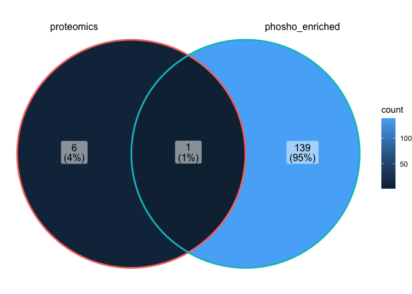

<!-- README.md is generated from README.Rmd. Please edit that file -->

# GLabR

<!-- badges: start -->
<!-- badges: end -->

The goal of GLabR is to provide a centralized locations to hold
functions that are routinely useful in the Gonzalez Lab at UCSD

## Installation

You can install the development version of GLabR like so:

``` r
devtools::install_github("baynec2/GlabR")
```

## Examples

### Data normalization (batch correction)

The first use case of GlabR is to normalize data that we export from
proteome discoverer. Here, a text file containing PSMs is exported and
subsequently needs to be processed. To accomplish this, there are a few
different steps that need to be followed . These are described below.

1.  We need to combine PSMs from each of the different fractions (there
    are multiple fractions corresponding to a single sample). This is
    accomplished using the combine_psm_fractions() function.
    Essentially, this function filters out PSMs based on certain
    criteria and then sums the intensities for each protein that they
    map to.

2.  Then we need to normalize our data to account for batch corrections.
    This is accomplished using the normalize_to_bridge() function.

-   In some cases, there may not be a bridge channel included, and in
    these cases we will need to use the normalize_1plex() function
    instead

3.  After this, we still might want to normalize the data further. To
    get data that is more normally distributed, we can use Leigh-ana’s
    method of box cox normalization through the la_box_cox_norm()
    function.

Here we can see an example of the overall workflow using a single plex
example set

``` r
library(GLabR)

data = read_delim("tests/testdata/combine_psm_fractions/PCB002_PSMs_Proteodiscover_output.txt") %>% 
  combine_psm_fractions() %>% 
  normalize_1plex()
 
head(data)                   
#> # A tibble: 6 × 8
#>   Sample TMT   ProteinID  value protein_avg intermediate_norm median_of_sample_…
#>   <chr>  <chr> <chr>      <dbl>       <dbl>             <dbl>              <dbl>
#> 1 PCB002 126   A0A024R0K5 3419.       1803.             327.               183. 
#> 2 PCB002 127C  A0A024R0K5 1279.       1803.             122.                86.3
#> 3 PCB002 127N  A0A024R0K5 2368.       1803.             226.                98.9
#> 4 PCB002 128C  A0A024R0K5  591.       1803.              56.5              178. 
#> 5 PCB002 128N  A0A024R0K5 1656.       1803.             158.               129. 
#> 6 PCB002 129C  A0A024R0K5 1248.       1803.             119.               136. 
#> # … with 1 more variable: final_norm <dbl>
```

The final norm column has the completely normalized data.

Here we can see an example of the overall workflow using an example set
with multiple plexes

``` r
data = read_delim("tests/testdata/normalize_to_bridge/PSM_output.txt") %>% 
  combine_psm_fractions() %>% 
  normalize_to_bridge(bridge_channel_plex = 126)


head(data)
#> # A tibble: 6 × 8
#>   Sample   TMT   ProteinID value bridge_values intermediate_no… sample_plex_med…
#>   <chr>    <chr> <chr>     <dbl>         <dbl>            <dbl>            <dbl>
#> 1 DG014843 127C  A0A024R6…  351.          350.             78.8             78.4
#> 2 DG014843 127N  A0A024R6…  338.          350.             75.8             65.0
#> 3 DG014843 128C  A0A024R6…  320.          350.             71.6             74.1
#> 4 DG014843 128N  A0A024R6…  241.          350.             54.0             69.0
#> 5 DG014843 129C  A0A024R6…  436           350.             97.8             81.6
#> 6 DG014843 129N  A0A024R6…  408.          350.             91.6             80.0
#> # … with 1 more variable: final_norm <dbl>
```

If you prefer data in a wide format ( as reported using the previous
script), you can specify data_format = “wide” within the normalize to
bridge function. This will give a column containing the final_norm
values for each Sample/TMT combination. Note that this is also an option
for the normalize_1plex function. An example is shown below

``` r
data = read_delim("tests/testdata/normalize_to_bridge/PSM_output.txt") %>% 
  combine_psm_fractions() %>% 
  normalize_to_bridge(bridge_channel_plex = 126,data_format = "wide")


head(data)
#> # A tibble: 6 × 1,621
#>   ProteinID  DG014843_127C DG014843_127N DG014843_128C DG014843_128N
#>   <chr>              <dbl>         <dbl>         <dbl>         <dbl>
#> 1 A0A024R6I7          77.5          90.0          74.5          60.2
#> 2 A0A075B6H7          71.3          65.1          61.0          69.8
#> 3 A0A075B7D0          92.2         124.           78.7         136. 
#> 4 A0A087WVC6          74.4          80.2          59.0          76.2
#> 5 A0A096LPE2          78.8         139.           77.1          56.3
#> 6 A0A0A0MSV6          71.2          64.2          82.7          65.1
#> # … with 1,616 more variables: DG014843_129C <dbl>, DG014843_129N <dbl>,
#> #   DG014843_130C <dbl>, DG014843_130N <dbl>, DG014843_131C <dbl>,
#> #   DG014843_131N <dbl>, DG014843_132C <dbl>, DG014843_132N <dbl>,
#> #   DG014843_133C <dbl>, DG014843_133N <dbl>, DG014843_134N <dbl>,
#> #   DG014844_127C <dbl>, DG014844_127N <dbl>, DG014844_128C <dbl>,
#> #   DG014844_128N <dbl>, DG014844_129C <dbl>, DG014844_129N <dbl>,
#> #   DG014844_130C <dbl>, DG014844_130N <dbl>, DG014844_131C <dbl>, …
```

If we wanted to then use the box cox norm method, we could use
la_box_cox_norm() function.

``` r
data = read_delim("tests/testdata/combine_psm_fractions/PCB002_PSMs_Proteodiscover_output.txt") %>% 
  combine_psm_fractions() %>% 
  normalize_to_bridge(bridge_channel_plex = 126) %>% 
  la_box_cox_norm()


head(data)
#> # A tibble: 6 × 5
#>   Sample TMT   ProteinID  final_norm box_cox_scaled_values
#>   <chr>  <chr> <chr>           <dbl>                 <dbl>
#> 1 PCB002 127C  A0A024R0K5       96.6                 0.918
#> 2 PCB002 127N  A0A024R0K5      150.                  1.06 
#> 3 PCB002 128C  A0A024R0K5       24.4                 0.708
#> 4 PCB002 128N  A0A024R0K5       84.3                 0.898
#> 5 PCB002 129C  A0A024R0K5       59.6                 0.771
#> 6 PCB002 129N  A0A024R0K5       67.2                 0.826
```

Note that when using this function, it is expecting your data to be in
the long format. If not, it will not work. If you wish for the results
reported from la_box_cox_nrom to be in the wide format, you can specify
that like below.

``` r
data = read_delim("tests/testdata/combine_psm_fractions/PCB002_PSMs_Proteodiscover_output.txt") %>% 
  combine_psm_fractions() %>% 
  normalize_to_bridge(bridge_channel_plex = 126) %>% 
  la_box_cox_norm(data_format = "wide")


head(data)
#> # A tibble: 6 × 5
#>   Sample TMT   ProteinID  final_norm box_cox_scaled_values
#>   <chr>  <chr> <chr>           <dbl>                 <dbl>
#> 1 PCB002 127C  A0A024R0K5       96.6                 0.918
#> 2 PCB002 127N  A0A024R0K5      150.                  1.06 
#> 3 PCB002 128C  A0A024R0K5       24.4                 0.708
#> 4 PCB002 128N  A0A024R0K5       84.3                 0.898
#> 5 PCB002 129C  A0A024R0K5       59.6                 0.771
#> 6 PCB002 129N  A0A024R0K5       67.2                 0.826
```

Out of curiosity, what does the normalized data look like when comparing
the two methods.

``` r
p1 = read_delim("tests/testdata/combine_psm_fractions/PCB002_PSMs_Proteodiscover_output.txt") %>% 
  combine_psm_fractions() %>% 
  normalize_to_bridge(bridge_channel_plex = 126) %>% 
  la_box_cox_norm() %>% 
  ggplot(aes(box_cox_scaled_values))+
  geom_histogram()+
  ggtitle("box cox scaled values")


p2 = read_delim("tests/testdata/combine_psm_fractions/PCB002_PSMs_Proteodiscover_output.txt") %>% 
  combine_psm_fractions() %>% 
  normalize_to_bridge(bridge_channel_plex = 126) %>% 
  ggplot(aes(final_norm))+
  geom_histogram()+
  ggtitle("batch corrected")

p3 = ggpubr::ggarrange(p1,p2)

p3
```

 Here
we can see the overall distribution of the data. Looks like the box cox
does a pretty good job of normalizing the data!

Note that when I was making this package, I discovered a problem in the
script that was originally used to normalize the data. Essentially, the
original script was only assigning the NAs from some columns as 1,
ultimately causing results to deviate from what was intended (NA from
all columns having 1)

Here I have kept the function that produces the same results as the
output from the original script (nonnormalizedall.txt) as
combine_psm_fractions_replica() for posterity.

Here we can see the slight differences produced from these different
functions.

``` r
#using function to replicate new process
new = read_delim("tests/testdata/combine_psm_fractions/PCB002_PSMs_Proteodiscover_output.txt") %>% 
  combine_psm_fractions() %>% 
  mutate(method = "new")

#using function to replicate old process
old = read_delim("tests/testdata/combine_psm_fractions/PCB002_PSMs_Proteodiscover_output.txt") %>% 
  combine_psm_fractions_replica() %>% 
  mutate(method = "old")

#Combining data
comb = bind_rows(new,old) %>% 
  pivot_wider(names_from = method, values_from = value)


#Plotting
p1 = comb %>% 
  ggplot(aes(new,old))+
  geom_point()+
  geom_smooth(method = "lm")

p1
```


As we can see above, while this data is correlated, it is not exactly
the same. **Future work should only use the combine_psm_fractions()
function.**

### Determining Differential Protein Abundance

Usually when analyzing proteomics data, we will be interested in
assessing the differences between two or more groups.

There are a number of ways to do this, but the most simple and most
commonly used approach to visualize the differentally abundant proteins
between tow groups would be by using a volcano plot. We can use GLabR to
easily plot a volcano plot as displayed in the code below.

First we have to load our data, and normalize it appropriately. To do
this we use the functions in GLabR that were previously described.

``` r
data = readr::read_delim("tests/testdata/combine_psm_fractions/PCB002_PSMs_Proteodiscover_output.txt") %>% 
  combine_psm_fractions() %>% 
  normalize_1plex() %>% 
  la_box_cox_norm() %>% 
  #Have to add the sample ID column manually by concating Sample and TMT.
  #Done outside of GLabR to allow the user freedom in determining naming convention and contents (. vs _ seperator etc) of what I would call Sample_ID
  dplyr::mutate(Sample_ID = paste0(Sample,".",TMT))
```

Next, we need to assign metadata that gives us information about what
each of these samples are.

``` r
# Loading metadata
md = readr::read_csv("tests/testdata/metadata.csv") %>% 
  #Removed redundant columns to prevent .x and .y columns in data_md
  dplyr::select(-Sample,-TMT)

# Appending md to data
data_md = dplyr::inner_join(data,md,by = "Sample_ID")
```

Now we can use the volcano_plot() function to plot the differences
between two types of samples using conditions contained in the metadata.
Here let’s compare the greatest disease severity to healthy controls
using the mayo score.

Note that the function has trouble dealing with weird column names, so
to avoid this use column names without spaces, :s, or other characters
that are dealt with differently in R

Also, note that you can change the p_theshold and log2fc threshold using
arguments. Any proteins above these thresholds will be plotted.

``` r
# Filtering our data to contain only the two conditions we want to test
f_data_md = data_md %>% 
  dplyr::filter(`Mayo_Endoscopic_Sub_Score` %in% c("Healthy_control","3: Severe disease (spontaneous bleeding, ulceration)")) 

#
volcano_plot(f_data_md,"Mayo_Endoscopic_Sub_Score",p_threshold = 0.05,fc_threshold = 1)
```


Here we can see our volcano plot! We can note that there are 5 proteins
that meet our criteria, and are called out by ProteinID on the plot.
Note that this function uses the t_test function from the excellent
rstatix package to determine statistical significance. Importantly, the
pvalue reported has been adjusted for multiple comparisons using fdr.

### Protein Idenfification.

The next step in the process is figuring out what these proteins
actually are/ what they do. In order to do this, we can use a
compination of extract_sig_proteins and our annotate proteins function.

extract_sig_proteins is a function that is intended to extract the
proteinIDs that are significant given the desired parameters. If the
same parameters are passed to the function as volcano plot, the proteins
will match between the two. We can see this below.

``` r
sig_proteins = extract_sig_proteins(f_data_md,column_split_by = "Mayo_Endoscopic_Sub_Score",p_threshold = 0.05,fc_threshold = 1)

sig_proteins
#> [1] "E7EQB2" "P00450" "P01023" "P08246" "P28676"
```

Now that we have a list of our proteins we can figure out what they are
using the annotate_proteins function.

This function uses Uniprot’s API to return results pertaining to the
proteins. There is a package called UniprotR that handles this, but it
was way too slow for long lists of protein IDs, so I made this solution.
We can annotate these proteins as follows.

``` r
annotated_proteins = annotate_proteins(sig_proteins)

annotated_proteins
#> # A tibble: 5 × 7
#>   Entry  Entry.Name   Reviewed   Protein.names        Gene.Names Organism Length
#>   <chr>  <chr>        <chr>      <chr>                <chr>      <chr>     <int>
#> 1 P08246 ELNE_HUMAN   reviewed   Neutrophil elastase… ELANE ELA2 Homo sa…    267
#> 2 P01023 A2MG_HUMAN   reviewed   Alpha-2-macroglobul… A2M CPAMD… Homo sa…   1474
#> 3 P28676 GRAN_HUMAN   reviewed   Grancalcin           GCA GCL    Homo sa…    217
#> 4 P00450 CERU_HUMAN   reviewed   Ceruloplasmin, EC 1… CP         Homo sa…   1065
#> 5 E7EQB2 E7EQB2_HUMAN unreviewed Lactotransferrin     LTF        Homo sa…    696
```

Let’s say you wanted to get different information about these proteins.
To do that, you can specify what columns to return through the columns
argument. This argument takes a string of the column names that you want
to add separated by columns. The complete list of field names that are
accepted can be found here:
<https://www.uniprot.org/help/return_fields>.

In this example, lets say we want to get the GO biological process terms
for our proteins (column name accessed through api by “go_p”. We can do
this as follows.

``` r
# Result table will have accesssion and GO biological process info
annotated_proteins_GO_p = annotate_proteins(sig_proteins,columns ="accession,go_p")

annotated_proteins_GO_p
#> # A tibble: 5 × 2
#>   Entry  Gene.Ontology..biological.process.                                     
#>   <chr>  <chr>                                                                  
#> 1 P08246 acute inflammatory response to antigenic stimulus [GO:0002438]; biosyn…
#> 2 P01023 acute inflammatory response to antigenic stimulus [GO:0002438]; acute-…
#> 3 P28676 membrane fusion [GO:0061025]                                           
#> 4 P00450 cellular iron ion homeostasis [GO:0006879]; copper ion transport [GO:0…
#> 5 E7EQB2 antibacterial humoral response [GO:0019731]; antifungal humoral respon…
```

Here we can see that information!

### Phosphoproteomics

The above code is great for looking at proteomics, but sometimes we will
want to look at phospo post translational modifications.

The calc_phospho_ratio function allows us to do this! We can see an
example below:

``` r
proteomics_data = readr::read_delim("tests/testdata/psm_phospho_mod/PCB002_PSMs.txt")
phospho_data = readr::read_delim("tests/testdata/psm_phospho_mod/PCB001_PSM.txt")
metadata = readxl::read_excel("tests/testdata/psm_phospho_mod/metadata.xlsx")
#In this dataset, patient ID is the variable that we want to use to  combine the phospho and proteomic data. 
col_identifying_match = "PatientID"

phospho_ratio = calc_phospho_ratio(proteomics_data,phospho_data,metadata,col_identifying_match,1)

head(phospho_ratio)
#> # A tibble: 6 × 7
#>   PatientID ProteinID  Annotated_Sequen… ptmRS phospho_box_cox… proteomics_box_…
#>   <chr>     <chr>      <chr>             <chr>            <dbl>            <dbl>
#> 1 0572      A0A024R0K5 [K].LTIESTPFNVAE… NA               1.35             1.31 
#> 2 C2        A0A024R0K5 [K].LTIESTPFNVAE… NA               0.520            1.12 
#> 3 C4        A0A024R0K5 [K].LTIESTPFNVAE… NA               1.59             1.45 
#> 4 0530      A0A024R0K5 [K].LTIESTPFNVAE… NA               0.839            0.748
#> 5 0672      A0A024R0K5 [K].LTIESTPFNVAE… NA               1.09             1.08 
#> 6 0185      A0A024R0K5 [K].LTIESTPFNVAE… NA               0.902            0.939
#> # … with 1 more variable: Phospho_Prot_ratio <dbl>
```

In short, this code pairs up corresponding proteomics and
phosphoproteomics data sets and then calculates the ratio of
phosphorylation to using the box cox normalized data.

Sometimes, it will be useful to compare how many unique
peptide-sequences-PTM are present in a phosphoenriched experiment,
compared to a normal proteomics experiment. Not that in order to do
this, you must have your proteome discoverer analysis set up to report
infomration about phosphorylated peptides. You can do this by setting
dynamic settings to accomodate phospho mods in the sequest node, and
enabling the ptmRS node.

Once you have these results, you can compare them using the following
code. Note that for this to make any sense to do, the experiments should
contain the same samples.

``` r
phospho_enriched = readr::read_delim("tests/testdata/psm_phospho_mod/PCB001_PSM.txt")

proteomics = readr::read_delim("tests/testdata/phospho_venn_diagram/PCB002_proteomics_ptmRS_data.txt")

phospho_venn_diagram(proteomics,phospho_enriched)
```


Here we can see that the phospho enriched experiment enriched for
phospho peptides, as we would expect.
