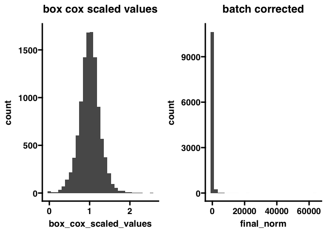

<!-- README.md is generated from README.Rmd. Please edit that file -->

# GLabR

<!-- badges: start -->
<!-- badges: end -->

The goal of GLabR is to provide a centralized locations to hold
functions that are routinely useful in the Gonzalez Lab at UCSD

## Installation

You can install the development version of GLabR like so:

``` r
devtools::install_github("baynec2/GlabR")
```

## Examples

### Data normalization (batch correction)

The first use case of GlabR is to normalize data that we export from
proteome discoverer. Here, a text file containing PSMs is exported and
subsequently needs to be processed. To accomplish this, there are a few
different steps that need to be followed . These are described below.

1.  We need to combine PSMs from each of the different fractions (there
    are multiple fractions corresponding to a single sample). This is
    accomplished using the combine_psm_fractions() function.
    Essentially, this function filters out PSMs based on certain
    criteria and then sums the intensities for each protein that they
    map to.

2.  Then we need to normalize our data to account for batch corrections.
    This is accomplished using the normalize_to_bridge() function.

-   In some cases, there may not be a bridge channel included, and in
    these cases we will need to use the normalize_1plex() function
    instead

3.  After this, we still might want to normalize the data further. To
    get data that is more normally distributed, we can use Leigh-ana’s
    method of box cox normalization through the la_box_cox_norm()
    function.

Here we can see an example of the overall workflow using a single plex
example set

``` r
library(GLabR)

data = read_delim("tests/testdata/combine_psm_fractions/PCB002_PSMs_Proteodiscover_output.txt") %>% 
  combine_psm_fractions() %>% 
  normalize_1plex()
 
head(data)                   
#> # A tibble: 6 × 8
#>   Sample TMT   ProteinID  value protein_avg intermediate_norm median_of_sample_…
#>   <chr>  <chr> <chr>      <dbl>       <dbl>             <dbl>              <dbl>
#> 1 PCB002 126   A0A024R0K5 3419.       1803.             327.               183. 
#> 2 PCB002 127C  A0A024R0K5 1279.       1803.             122.                86.3
#> 3 PCB002 127N  A0A024R0K5 2368.       1803.             226.                98.9
#> 4 PCB002 128C  A0A024R0K5  591.       1803.              56.5              178. 
#> 5 PCB002 128N  A0A024R0K5 1656.       1803.             158.               129. 
#> 6 PCB002 129C  A0A024R0K5 1248.       1803.             119.               136. 
#> # … with 1 more variable: final_norm <dbl>
```

The final norm column has the completely normalized data.

Here we can see an example of the overall workflow using an example set
with multiple plexes

``` r
data = read_delim("tests/testdata/normalize_to_bridge/PSM_output.txt") %>% 
  combine_psm_fractions() %>% 
  normalize_to_bridge(bridge_channel_plex = 126)


head(data)
#> # A tibble: 6 × 8
#>   Sample   TMT   ProteinID value bridge_values intermediate_no… sample_plex_med…
#>   <chr>    <chr> <chr>     <dbl>         <dbl>            <dbl>            <dbl>
#> 1 DG014843 127C  A0A024R6…  351.          350.             78.8             78.4
#> 2 DG014843 127N  A0A024R6…  338.          350.             75.8             65.0
#> 3 DG014843 128C  A0A024R6…  320.          350.             71.6             74.1
#> 4 DG014843 128N  A0A024R6…  241.          350.             54.0             69.0
#> 5 DG014843 129C  A0A024R6…  436           350.             97.8             81.6
#> 6 DG014843 129N  A0A024R6…  408.          350.             91.6             80.0
#> # … with 1 more variable: final_norm <dbl>
```

If you prefer data in a wide format ( as reported using the previous
script), you can specify data_format = “wide” within the normalize to
bridge function. This will give a column containing the final_norm
values for each Sample/TMT combination. Note that this is also an option
for the normalize_1plex function. An example is shown below

``` r
data = read_delim("tests/testdata/normalize_to_bridge/PSM_output.txt") %>% 
  combine_psm_fractions() %>% 
  normalize_to_bridge(bridge_channel_plex = 126,data_format = "wide")


head(data)
#> # A tibble: 6 × 1,621
#>   ProteinID  DG014843_127C DG014843_127N DG014843_128C DG014843_128N
#>   <chr>              <dbl>         <dbl>         <dbl>         <dbl>
#> 1 A0A024R6I7          77.5          90.0          74.5          60.2
#> 2 A0A075B6H7          71.3          65.1          61.0          69.8
#> 3 A0A075B7D0          92.2         124.           78.7         136. 
#> 4 A0A087WVC6          74.4          80.2          59.0          76.2
#> 5 A0A096LPE2          78.8         139.           77.1          56.3
#> 6 A0A0A0MSV6          71.2          64.2          82.7          65.1
#> # … with 1,616 more variables: DG014843_129C <dbl>, DG014843_129N <dbl>,
#> #   DG014843_130C <dbl>, DG014843_130N <dbl>, DG014843_131C <dbl>,
#> #   DG014843_131N <dbl>, DG014843_132C <dbl>, DG014843_132N <dbl>,
#> #   DG014843_133C <dbl>, DG014843_133N <dbl>, DG014843_134N <dbl>,
#> #   DG014844_127C <dbl>, DG014844_127N <dbl>, DG014844_128C <dbl>,
#> #   DG014844_128N <dbl>, DG014844_129C <dbl>, DG014844_129N <dbl>,
#> #   DG014844_130C <dbl>, DG014844_130N <dbl>, DG014844_131C <dbl>, …
```

If we wanted to then use the box cox norm method, we could use
la_box_cox_norm() function.

``` r
data = read_delim("tests/testdata/combine_psm_fractions/PCB002_PSMs_Proteodiscover_output.txt") %>% 
  combine_psm_fractions() %>% 
  normalize_to_bridge(bridge_channel_plex = 126) %>% 
  la_box_cox_norm()


head(data)
#> # A tibble: 6 × 5
#>   Sample TMT   ProteinID  final_norm box_cox_scaled_values
#>   <chr>  <chr> <chr>           <dbl>                 <dbl>
#> 1 PCB002 127C  A0A024R0K5       96.6                 0.918
#> 2 PCB002 127N  A0A024R0K5      150.                  1.06 
#> 3 PCB002 128C  A0A024R0K5       24.4                 0.708
#> 4 PCB002 128N  A0A024R0K5       84.3                 0.898
#> 5 PCB002 129C  A0A024R0K5       59.6                 0.771
#> 6 PCB002 129N  A0A024R0K5       67.2                 0.826
```

Note that when using this function, it is expecting your data to be in
the long format. If not, it will not work. If you wish for the results
reported from la_box_cox_nrom to be in the wide format, you can specify
that like below.

``` r
data = read_delim("tests/testdata/combine_psm_fractions/PCB002_PSMs_Proteodiscover_output.txt") %>% 
  combine_psm_fractions() %>% 
  normalize_to_bridge(bridge_channel_plex = 126) %>% 
  la_box_cox_norm(data_format = "wide")


head(data)
#> # A tibble: 6 × 5
#>   Sample TMT   ProteinID  final_norm box_cox_scaled_values
#>   <chr>  <chr> <chr>           <dbl>                 <dbl>
#> 1 PCB002 127C  A0A024R0K5       96.6                 0.918
#> 2 PCB002 127N  A0A024R0K5      150.                  1.06 
#> 3 PCB002 128C  A0A024R0K5       24.4                 0.708
#> 4 PCB002 128N  A0A024R0K5       84.3                 0.898
#> 5 PCB002 129C  A0A024R0K5       59.6                 0.771
#> 6 PCB002 129N  A0A024R0K5       67.2                 0.826
```

Out of curiosity, what does the normalized data look like when comparing
the two methods.

``` r
p1 = read_delim("tests/testdata/combine_psm_fractions/PCB002_PSMs_Proteodiscover_output.txt") %>% 
  combine_psm_fractions() %>% 
  normalize_to_bridge(bridge_channel_plex = 126) %>% 
  la_box_cox_norm() %>% 
  ggplot(aes(box_cox_scaled_values))+
  geom_histogram()+
  ggtitle("box cox scaled values")


p2 = read_delim("tests/testdata/combine_psm_fractions/PCB002_PSMs_Proteodiscover_output.txt") %>% 
  combine_psm_fractions() %>% 
  normalize_to_bridge(bridge_channel_plex = 126) %>% 
  ggplot(aes(final_norm))+
  geom_histogram()+
  ggtitle("batch corrected")

p3 = ggpubr::ggarrange(p1,p2)

p3
```

 Here
we can see the overall distribution of the data. Looks like the box cox
does a pretty good job of normalizing the data!

Note that when I was making this package, I discovered a problem in the
script that was originally used to normalize the data. Essentially, the
original script was only assigning the NAs from some columns as 1,
ultimately causing results to deviate from what was intended (NA from
all columns having 1)

Here I have kept the function that produces the same results as the
output from the original script (nonnormalizedall.txt) as
combine_psm_fractions_replica() for posterity.

Here we can see the slight differences produced from these different
functions.

``` r
#using function to replicate new process
new = read_delim("tests/testdata/combine_psm_fractions/PCB002_PSMs_Proteodiscover_output.txt") %>% 
  combine_psm_fractions() %>% 
  mutate(method = "new")

#using function to replicate old process
old = read_delim("tests/testdata/combine_psm_fractions/PCB002_PSMs_Proteodiscover_output.txt") %>% 
  combine_psm_fractions_replica() %>% 
  mutate(method = "old")

#Combining data
comb = bind_rows(new,old) %>% 
  pivot_wider(names_from = method, values_from = value)


#Plotting
p1 = comb %>% 
  ggplot(aes(new,old))+
  geom_point()+
  geom_smooth(method = "lm")

p1
```


As we can see above, while this data is correlated, it is not exactly
the same. **Future work should only use the combine_psm_fractions()
function.**
